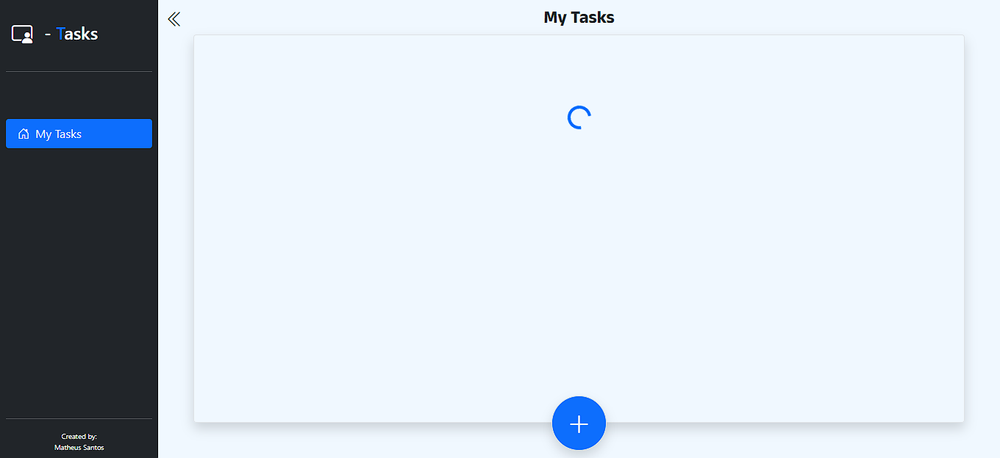
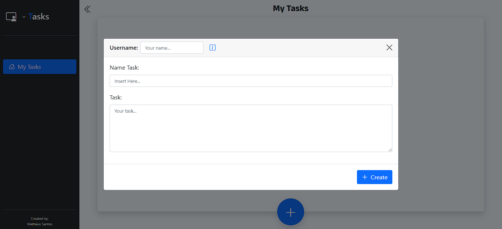
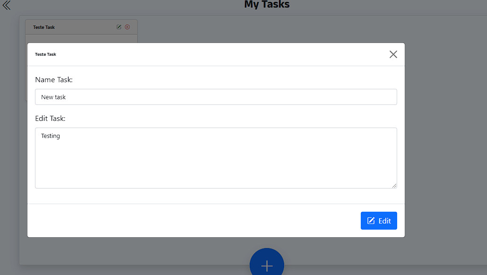
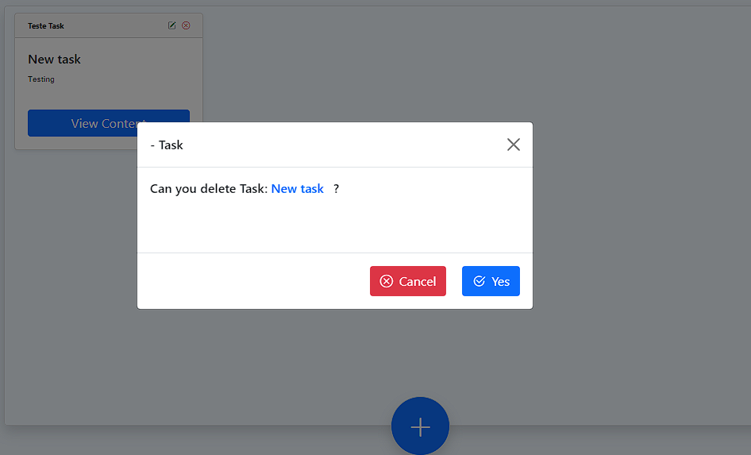
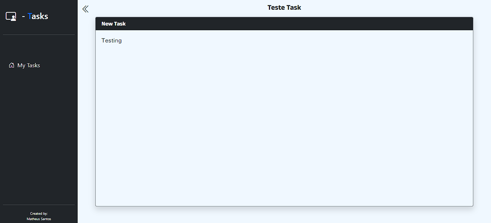

Create Read Update Delete Task´s ✔ 

### Link da aplicação ↓
- https://kain-prog.github.io/task-front/

> Descrição:
Projeto destiano à requisição de consumo de rotas [projeto server-tasks] e criação da interface, utilizando métodos e UX e UI para afins de aprimoramento de prática com tecnologias do momento.

- [x] - Página Home e painel de tarefas.
- [x] - Ser possível criar tarefas.
- [x] - Ser possível editar e deletar tarefas existentes.
- [x] - Renderizar todas as tarefas na home-page.
- [x] - Aplicação responsiva e menu com expansão.

**IMPORTANTE** - É possível criar, editar e deletar tarefas em tempo real, sendo visto e acessível para todos.

 
 
 
 
 
 

> A aplicação se encontra com o intuito de criar, editar e ler tarefas, rotinas e qualquer tipo de dados que sejam consumidos e lembrados em tempo real, sem se preocupar com o tempo e com os dados inseridos.

O projeto foi criado em:

- [x] - ReactJS
- [x] - TypeScript
- [x] - Bootstrap
- [x] - React-Bootstrap
- [x] - Bootstrap-icons
- [x] - Axios
- [x] - Router-DOM

## 🤝 Colaboradores

Pessoa que contribuiu para este projeto:

<table>
  <tr>
    <td align="center">
      <a href="https://kain-prog.github.io/kain">
         
        
          <b>Matheus Santos [Kain Developer]</b>
        
      </a>
    </td>
  </tr>
</table>